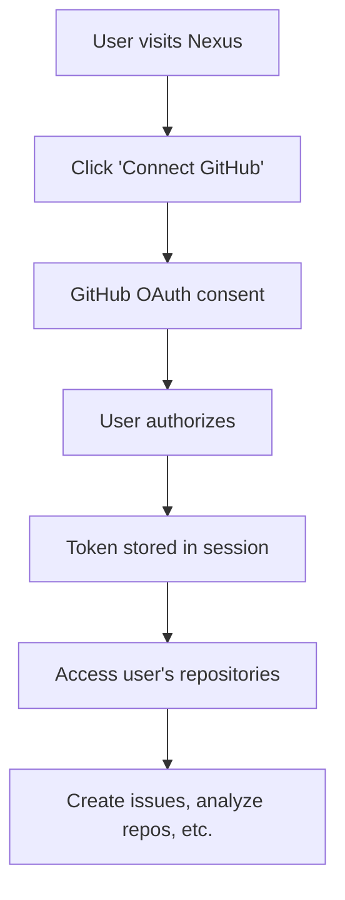

# GitHub Authentication Architecture for Nexus

## 🔐 **Authentication Flow Overview**

Nexus uses a **user-centric GitHub OAuth flow** that allows ANY user to connect their own GitHub account, ensuring the platform can work with any repository the user has access to.

## 🏗️ **Architecture Components**

### **1. GitHub OAuth App (Platform-Level)**
- **Purpose**: Enables users to authenticate with their own GitHub accounts
- **Scope**: Works with ANY GitHub user account
- **Location**: Created by platform deployer, used by all users
- **Configuration**: `frontend/.env.local`

```bash
# GitHub OAuth App - Allows ANY user to connect their GitHub
GITHUB_CLIENT_ID=your-oauth-app-client-id
GITHUB_CLIENT_SECRET=your-oauth-app-client-secret
```

### **2. User Authentication Flow**
1. **User Login**: User clicks "Connect GitHub" on Nexus platform
2. **OAuth Redirect**: User is redirected to GitHub OAuth consent screen
3. **User Consent**: User authorizes Nexus to access their GitHub account
4. **Token Exchange**: GitHub returns user's access token to Nexus
5. **Repository Access**: Nexus can now access user's repositories using their token

### **3. Repository Access Pattern**
```
User's GitHub Account → OAuth Token → Nexus Platform → User's Repositories
```

## 🔑 **Token Management**

### **User Tokens (Dynamic)**
- **Source**: Generated when user authenticates via OAuth
- **Scope**: User's repositories and profile
- **Storage**: Secure session storage (NextAuth.js)
- **Usage**: All repository operations for that user

### **Server Token (Optional)**
- **Source**: Platform deployer's personal access token
- **Scope**: Minimal (public repos, basic user info)
- **Usage**: Server-side operations, fallback scenarios
- **Configuration**: `adk-nexus/.env`

```bash
# Optional server token for backend operations
GITHUB_TOKEN=your-server-github-token
```

## 🚀 **Benefits of This Architecture**

### **✅ Universal Access**
- Users can work with ANY repository they have access to
- No limitation to platform deployer's repositories
- Supports private repositories (with user consent)

### **✅ Security**
- Each user's repositories are accessed with their own permissions
- No shared credentials between users
- Platform deployer's token has minimal scope

### **✅ Scalability**
- Single OAuth app serves unlimited users
- No per-user configuration required
- Automatic permission inheritance from user's GitHub account

## 🛠️ **Setup Instructions**

### **For Platform Deployers**

1. **Create GitHub OAuth App**:
   ```
   Name: Nexus Platform
   Homepage: https://your-domain.com
   Callback URL: https://your-domain.com/api/auth/callback/github
   Description: Blockchain-backed platform for trustless open-source collaboration
   ```

2. **Configure Environment**:
   ```bash
   # frontend/.env.local
   GITHUB_CLIENT_ID=your-oauth-app-client-id
   GITHUB_CLIENT_SECRET=your-oauth-app-client-secret
   ```

3. **Optional Server Token** (minimal permissions):
   ```bash
   # adk-nexus/.env
   GITHUB_TOKEN=your-server-token  # Optional
   ```

### **For Users**
1. Visit Nexus platform
2. Click "Connect GitHub"
3. Authorize the application
4. Access your repositories through Nexus

## 🔒 **Security Considerations**

### **OAuth App Security**
- Client secret must be kept secure
- Use HTTPS in production
- Implement proper CSRF protection

### **Token Storage**
- User tokens stored in secure sessions
- Automatic token refresh when possible
- Proper token cleanup on logout

### **Permission Scope**
- Request minimal necessary permissions
- Clearly communicate what access is needed
- Allow users to revoke access anytime

## 📊 **User Experience Flow**



## 🎯 **Key Advantages**

1. **No Repository Limitations**: Works with any GitHub repository
2. **User Privacy**: Each user's data accessed with their own permissions
3. **Easy Onboarding**: Simple OAuth flow for new users
4. **Secure by Design**: No shared credentials or hardcoded tokens
5. **Scalable**: Single OAuth app serves unlimited users

This architecture ensures Nexus can truly be a platform for **any** open-source collaboration, not just repositories owned by the platform deployer.
